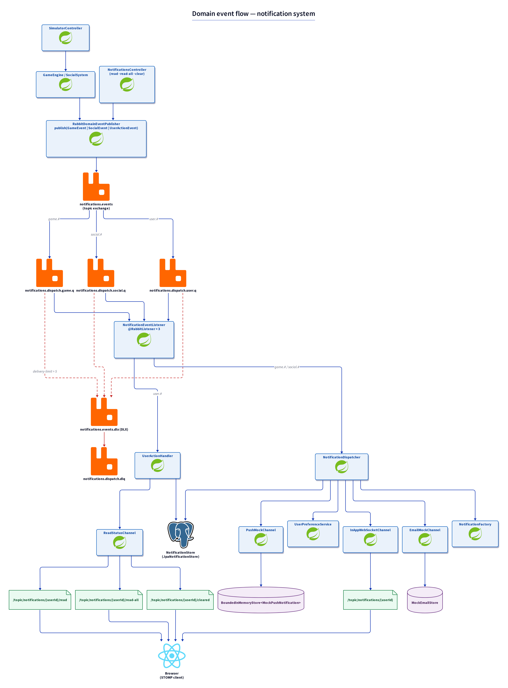

# Notification System

Real-time notification system for a gaming platform. Java 21 + Spring Boot backend, React + TypeScript frontend, RabbitMQ broker, PostgreSQL persistence, STOMP-over-WebSocket transport to the client.

## Host requirements

Only `docker` and `make`. Nothing else is installed locally (see `CLAUDE.md`). Maven, JDK, Node, npm, psql, and `rabbitmqctl` are invoked inside containers through the `Makefile`.

## Stack

- **Backend**: Java 21, Spring Boot, Spring AMQP, Spring Data JPA, Spring WebSocket (STOMP).
- **Frontend**: React + TypeScript (Vite), STOMP.js, ESLint + Prettier.
- **Broker**: RabbitMQ 3.13 (quorum queues + DLX).
- **DB**: PostgreSQL 16.
- **Tests**: JUnit + Testcontainers (RabbitMQ + Postgres), run via dind.

## Bringing the system up

```sh
make up            # backend (8080) + frontend (5173) + rabbitmq (5672/15672) + postgres (5432)
make demo          # alias for up + log tail (prints URLs)
make logs          # tail logs from all services
make ps            # container status
make down          # stop and clean up
```

URLs:

- Frontend: http://localhost:5173
- Backend (REST + WS): http://localhost:8080
- RabbitMQ management: http://localhost:15672 (`guest`/`guest`)

## Build, test, and quality

```sh
make build              # build-backend (jar) + build-frontend (bundle)
make build-backend
make build-frontend
make test               # backend unit + integration (Testcontainers via dind)
make fmt                # google-java-format
make fmt-check
make frontend-typecheck
make frontend-lint
make clean              # removes target/, dist/, node_modules/
```

## Operational utilities

```sh
make rabbit-ui          # opens the RabbitMQ console
make logs-rabbit
make rabbit-cli  ARGS="list_queues"
make rabbit-purge       # purges the DLQ notifications.dispatch.dlq
make db-shell           # psql against the postgres container
make logs-postgres
make mvn  ARGS="dependency:tree"
make npm  ARGS="install --save lodash"
```

## Quick verification

1. `make up`
2. Open http://localhost:5173 in two tabs with different `userId`s.
3. Click *Level Up* — the message appears only in the target user's tab.
4. Toggle *GAME* off → click *Item Acquired* → it does not appear. *Friend Request* (SOCIAL category) does.
5. Mark as read / clear all — the unread badge updates in real time.
6. Click *Friend Request* or *Friend Accepted* and open the **Mailbox** tab (http://localhost:5173/mailbox): in addition to the in-app notification, a simulated email shows up. Also queryable via `curl http://localhost:8080/api/mock-emails?userId=2 | jq`.
7. Open the **Push** tab (http://localhost:5173/push): *Friend Request*, *Friend Accepted* and *New Follower* also generate a mock push notification. Also queryable via `curl http://localhost:8080/api/mock-push?userId=2 | jq`.
8. In the Preferences panel, uncheck the **Email** or **Push** channel for user 2 → trigger another Friend Request → the in-app notification still arrives but the corresponding mock store stays empty. Toggle the master **Receive notifications** off → triggering any event has no effect (no in-app, no mock email, no mock push, nothing in `/api/users/2/notifications`).

### Events → Channels

| Event                                                                      | In-App WS | Email mock | Push mock |
| -------------------------------------------------------------------------- | --------- | ---------- | --------- |
| `FriendRequestSent`                                                        | ✅        | ✅         | ✅        |
| `FriendRequestAccepted`                                                    | ✅        | ✅         | ✅        |
| `NewFollower`                                                              | ✅        | —          | ✅        |
| `PlayerLeveledUp`, `ItemAcquired`, `ChallengeCompleted`, `PlayerDefeatedInPvp` | ✅     | —          | —         |

The email and push channels are mocks: no SMTP and no APNs/FCM are involved. Generated artifacts are kept in memory through a shared `BoundedInMemoryStore<T>` (capped at 500 entries per store) and exposed via REST and dedicated tabs in the frontend.

## Architecture

### Domain event flow



Source: [`docs/event-flow.d2`](docs/event-flow.d2) ([D2](https://d2lang.com), rendered with the ELK layout engine). Regenerate with:

```sh
make docs-diagram
```

If a message exceeds `x-delivery-limit` (5) attempts it is routed to the `notifications.events.dlx` DLX and ends up in the `notifications.dispatch.dlq` queue (purgeable with `make rabbit-purge`).

### Domain events

| Event | Category | Routing key |
| --- | --- | --- |
| `PlayerLeveledUp` | GAME | `game.player.leveled-up` |
| `PlayerDefeatedInPvp` | GAME | `game.player.defeated-pvp` |
| `ItemAcquired` | GAME | `game.item.acquired` |
| `ChallengeCompleted` | GAME | `game.challenge.completed` |
| `FriendRequestSent` | SOCIAL | `social.friend.request-sent` |
| `FriendRequestAccepted` | SOCIAL | `social.friend.request-accepted` |
| `NewFollower` | SOCIAL | `social.follower.new` |
| `NotificationRead` | (user action) | `user.notification.read` |
| `AllNotificationsRead` | (user action) | `user.notifications.all-read` |
| `NotificationsCleared` | (user action) | `user.notifications.cleared` |

User actions (`user.#`) are consumed by `UserActionHandler`, which updates the `NotificationStore` and emits state changes through `ReadStatusChannel` to the client.

### Persistence

`NotificationStore` defines the API; `JpaNotificationStore` is the production implementation (Postgres) and `InMemoryNotificationStore` is used in fast tests. It supports cursor pagination (`findPage(userId, cursor, limit)`, `DEFAULT_PAGE_SIZE`, `MAX_PAGE_SIZE = 100`) and unread counting.

### Channels

A channel implements `NotificationChannel`. Spring injects all beans of that type and the dispatcher iterates over them, so adding SMS / real Email / real Push = one new class, without touching the dispatcher. Channels that only react to a subset of `NotificationType`s extend `AbstractFilteredChannel`, which centralises the type filter and the title lookup.

- `InAppWebSocketChannel` → `/topic/notifications/{userId}` via `SimpMessagingTemplate`.
- `EmailMockChannel` → records a `MockEmail` in a `BoundedInMemoryStore` for `FRIEND_REQUEST` / `FRIEND_ACCEPTED`.
- `PushMockChannel` → records a `MockPushNotification` in a `BoundedInMemoryStore` for `FRIEND_REQUEST`, `FRIEND_ACCEPTED`, and `NEW_FOLLOWER`.
- `ReadStatusChannel` → emits state changes (read / cleared) to the same client.

### Preferences

`UserPreferenceService` keeps three independent per-user toggles:

- **Master switch** (`notificationsEnabled`, default `true`): when off, the dispatcher drops the notification entirely (no persist, no delivery).
- **Categories** (`GAME`, `SOCIAL`): an off category drops both persistence and delivery.
- **Delivery channels** (`IN_APP`, `EMAIL`, `PUSH`): when a channel is off the notification is still persisted, but that channel is skipped. Other channels keep delivering.

The dispatcher evaluates them in cascade: master → category → per-channel.

## API

API documentation is available at http://localhost:8080/swagger-ui/index.html.

## Frontend

Top-level navigation (React Router): **Generate**, **Notifications**, **Mailbox**, **Push**.

- `components/UserSelector` — active userId selector (multi-tab).
- `components/EventTriggerPanel` — buttons that call the REST simulator.
- `components/PreferencesPanel` — master switch, category toggles (`GAME`, `SOCIAL`) and channel toggles (`IN_APP`, `EMAIL`, `PUSH`).
- `components/NotificationList` — paginated list with mark-as-read / clear.
- `components/MockMailboxPanel` — per-user mock email inbox.
- `components/MockPushPanel` — per-user mock push feed.
- `hooks/useNotifications` — STOMP subscription + REST sync (pagination, unread count, read state).
- `hooks/useMockEmails`, `hooks/useMockPush` — REST polling for the mock channels.

## Repo structure

```
backend/src/main/java/com/globalli/notifications/
  api/             # REST controllers (notifications, preferences, simulator, mock-emails, mock-push)
  channel/         # NotificationChannel + AbstractFilteredChannel, WS / read-status / email-mock / push-mock
  config/          # Spring config (WebSocket, etc.)
  domain/          # Notification, NotificationType, NotificationCategory, DeliveryChannel, persistence/
  email/           # MockEmail record + store wiring
  push/            # MockPushNotification record + store wiring
  events/          # Domain events (Game/Social/UserAction)
  messaging/       # Rabbit topology, publishers, listeners, routing keys
  service/         # Dispatcher, Factory, Stores, UserPreferenceService, UserActionHandler
  simulators/      # GameEngine, SocialSystem
  support/         # BoundedInMemoryStore<T> shared by mock channels
frontend/src/
  components/      # UI (UserSelector, EventTriggerPanel, PreferencesPanel, NotificationList, MockMailboxPanel, MockPushPanel)
  hooks/           # useNotifications (STOMP + REST), useMockEmails, useMockPush
  lib/             # STOMP / fetch client
docker-compose.yml # rabbitmq, postgres, backend, frontend
Makefile           # single command surface
```

## Adding a new notification

A "notification" is the result of a domain event flowing through the pipeline. To add a new one, walk the pipeline end-to-end:

1. **Domain event** — add a `record` under `events/`, implementing the right marker interface (`GameEvent`, `SocialEvent`, or `UserActionEvent`). Include the `userId` that should receive the notification (or, for social events, `actorUserId` + `recipientUserId`).
2. **Routing key** — extend the corresponding `switch` in `EventRoutingKeys.routingKeyFor(...)` with a key under `game.#`, `social.#` or `user.#`. The exchange and queues already route it to the dispatcher; no Rabbit topology change is needed.
3. **Notification type** — add the value to `NotificationType` and assign it a `NotificationCategory` (`GAME` or `SOCIAL`). If the new bucket does not fit, add a value to `NotificationCategory` and surface it in the frontend `PreferencesPanel`.
4. **Factory mapping** — add the branch in `NotificationFactory.fromGameEvent` / `fromSocialEvent` that turns the event into a `Notification` (user, type, message).
5. **Publish the event** — emit it from the source: `GameEngine`, `SocialSystem`, or another producer. If you want to drive it from the UI, expose a new endpoint in `SimulatorController` and a button in `frontend/src/components/EventTriggerPanel`.
6. **Channels (optional)** — the `IN_APP` channel delivers everything by default. To make the new type also reach the mock email or push feed, add the `NotificationType` to the `enabledTypes()` set (and `TITLES` map) in `EmailMockChannel` / `PushMockChannel`. To deliver through a brand-new channel (SMS, real Email…), add a `DeliveryChannel` value, implement `NotificationChannel` (or extend `AbstractFilteredChannel`), and Spring will pick it up automatically — the dispatcher does not change.
7. **Tests** — cover the routing key, factory mapping, and dispatcher behavior with the existing `Testcontainers`-based suite (`make test`).

## Extending the system

- **New channel** (SMS, real Email, real Push, …): implement `NotificationChannel` (or extend `AbstractFilteredChannel` if it should fire only for some types). Spring injects it automatically; the dispatcher does not change.
- **New domain event**: add the record under `events/`, its branch in `EventRoutingKeys.routingKeyFor(...)`, mapping in `NotificationFactory`, and publish it from the simulator / corresponding source. The appropriate queue (`game.#` / `social.#` / `user.#`) already routes it.
- **New category**: add the value to `NotificationCategory`, expose it in the frontend, and map the new types to the corresponding enum.
