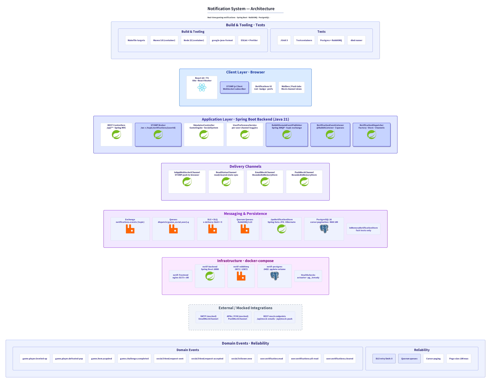

# System Architecture

Full-system architecture diagram for the notification system.



Source: [`system-architecture.d2`](system-architecture.d2) ([D2](https://d2lang.com), rendered with the ELK layout engine). Regenerate with:

```sh
make docs-arch
```

## Reading guide

- **Client Layer** — React + TypeScript SPA served by nginx; subscribes to STOMP
  topics `/topic/notifications/{userId}` and reads paginated history via REST.
- **Application Layer** — Spring Boot backend. The dispatch pipeline is
  highlighted (publisher → listener → dispatcher) since it is the spine of the
  system.
- **Delivery Channels** — implementations of `NotificationChannel`. `InApp` and
  `ReadStatus` are real (STOMP); `Email` and `Push` are in-process mocks backed
  by `BoundedInMemoryStore<T>` (cap 500).
- **Messaging & Persistence** — RabbitMQ topic exchange with three category
  queues (`game.#`, `social.#`, `user.#`) plus DLX/DLQ; PostgreSQL via JPA for
  durable history.
- **Infrastructure** — every component runs as a container under
  `docker-compose.yml`. The host only needs `docker` and `make`.
- **External / Mocked** — no real SMTP or APNs/FCM is wired in; the side panels
  expose the mock stores via REST and dedicated frontend tabs.
